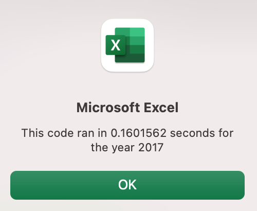
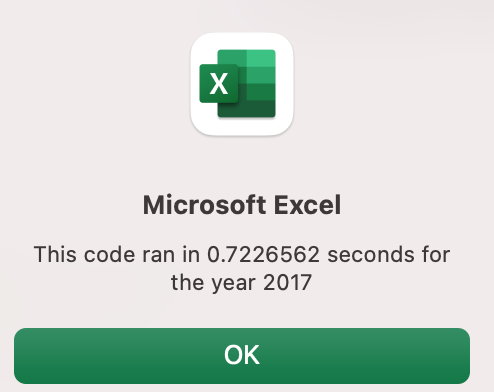
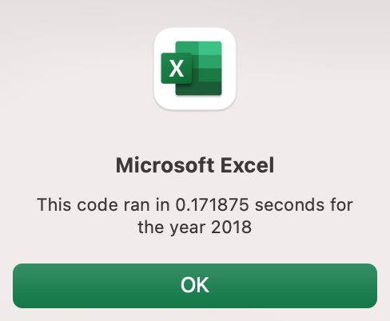
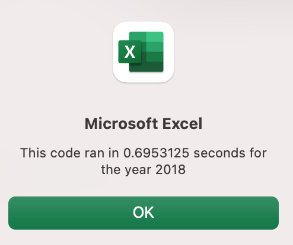

# stock_analysis
# Overview of the Project
Initially, code was written to analyze about a dozen stocks. It is determined that this code may not work well for thousands of stocks, and if it does, it may take a long time to execute. The code needs to be refactored to loop through all the data one time in order to collect the same information.

# Results
The stocks analyzed in the project saw a much greater return in 2017, with only one security yielding a negative return. However in 2018, two of the twelve stocks showed a positive return. 

# Execution time : Refactored vs Original
.  
 

The refactored code has decreased the runtime for both years

# Summary
One advantage of refactoring code is that it creates greater efficiency. The refactoring of the code for this analysis decreases the runtime by miliseconds, which may not seem like it is worth spending the time on. However, had this analysis been done on thousands of stocks, the runtime would have decreased drastically.
A disadvantage to refactoring code is that it may take a great deal of your time. 
